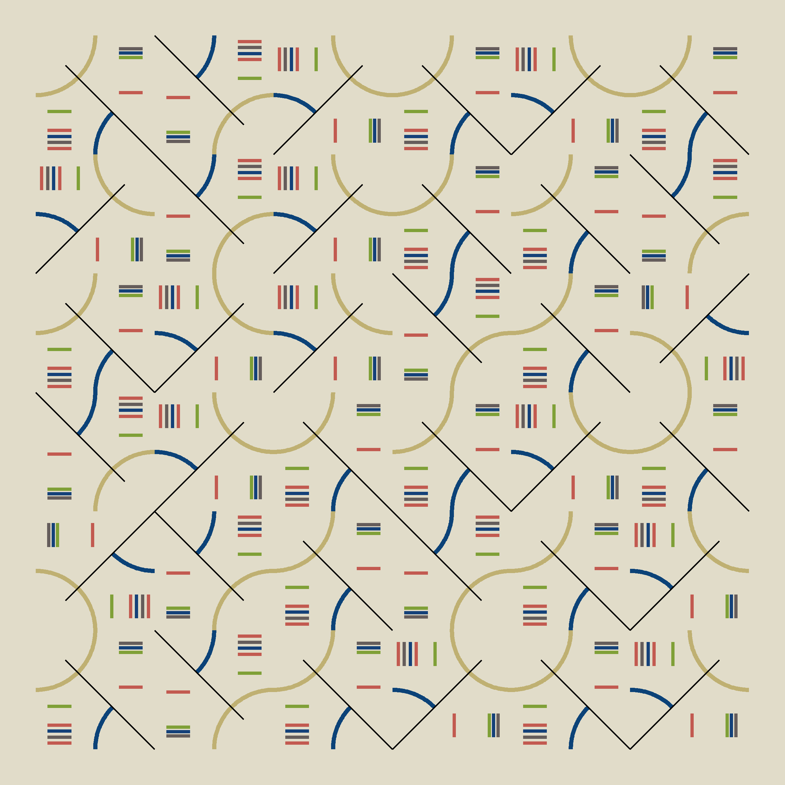
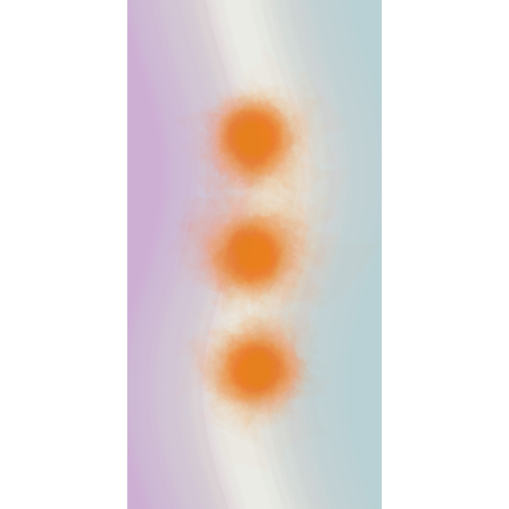
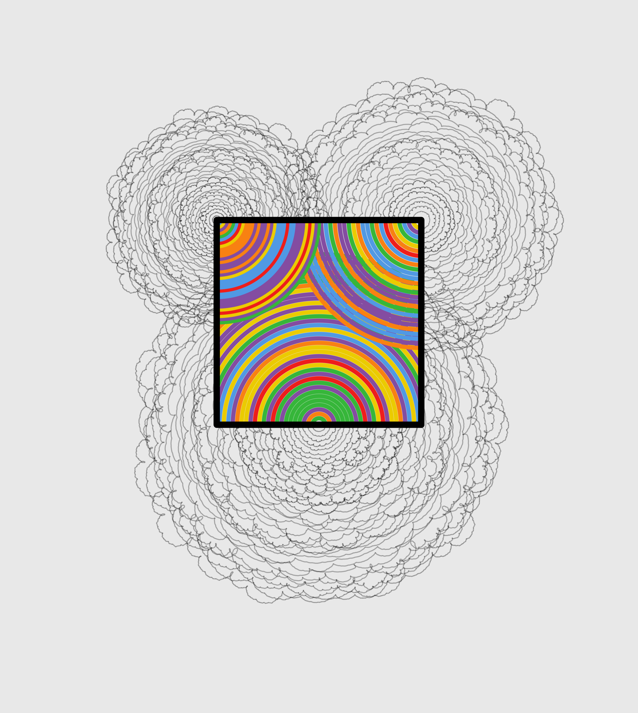
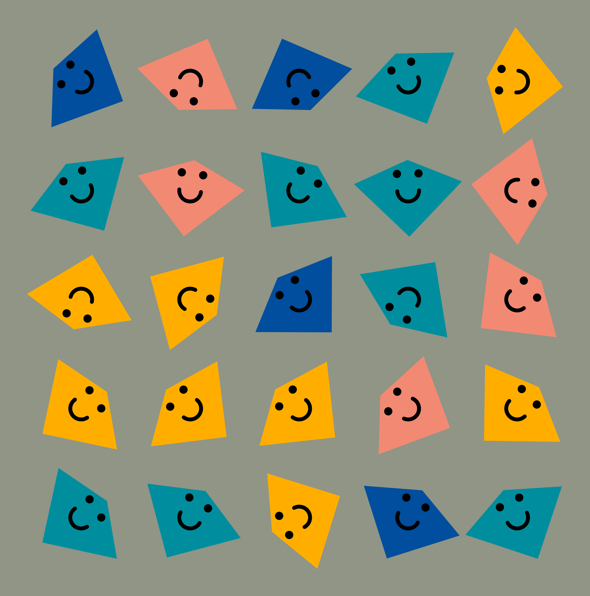
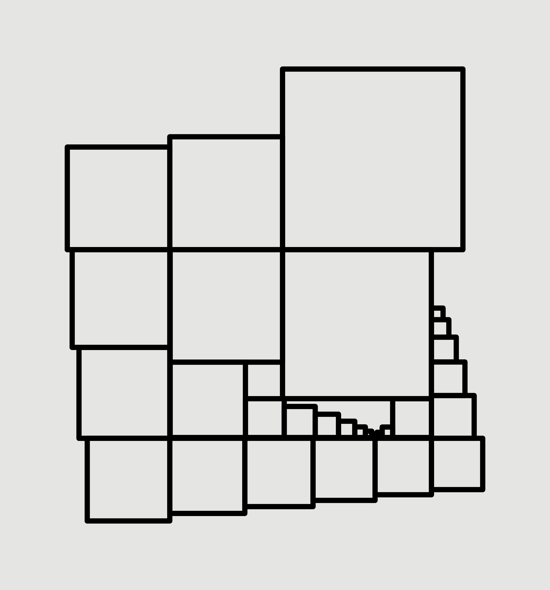

# RecreationThursday

#RecreationThursday is a social project for data visualization folks to recreate and remix existing art pieces through any medium of their choosing - through code, painting, music, embroidery, whatever! Our goal is to get creativity flowing and most importantly to have fun!

New pieces will be posted every two weeks on twitter under the #RecreationThursday hashtag, with a different curator each time! We encourage you to share your recreations over the following two weeks using the same hash tag.

Each art piece will be accompanied with alt-text to make this project as accessible as possible. We ask you to please include alt text with your recreations - feel free to use the alt-text we have provided as a starting point and update to capture your recreation as you see fit!

## Week 1

## Week 2

## Week 3

## Week 4

## Week 5

